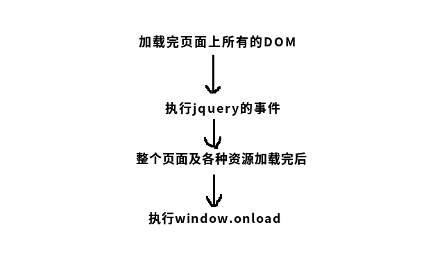

### 1.原生js与jquery对象的互相转换方式分别有哪些,请举例说明
##### 原生js转换成JQuery对象的方法
```
用$()把原生js包装起来
var oInpt = document.getElementsByTagName('input');
console.log($(oInpt).eq(1).val());
```
##### Jquery对象转换成原生js的方法
```
可以通过[0]的方法
var $inpt = $('input').eq(0);
var oInpt = $inpt[0];
console.log(oInpt.className);

通过.get(0)方法
var $inpt = $('input').eq(0);
var oInpt = $inpt.get(0);
console.log(oInpt.checked);
```

### 2.画图:jquery的ready事件和原生js的window.onload事件,在浏览器中的执行顺序


### 3.如何将一个 HTML 元素添加到 DOM 树中的,写一段实例代码说明？
```
document.getElementById("domId").innerHTML="<table><tr><td>123</td></tr></table>"
```
### 4.使用jQuery来提取一个HTML 标记的属性 例如. 链接的href, 写一段代码说明?
```
<a href="#"></a>
$("a").attr("href");

```
### 5.jQuery中 detach() 和 remove() 方法的区别是什么?
```
.detach() 方法和.remove()一样都是将元素移出DOM, 除了.detach()保存所有jQuery数据和被移走的元素关联。当需要移走一个元素，不久又将该元素插入DOM时，这种方法很有用。
```
### 6.如何利用jQuery来向一个元素中添加和移除CSS类?
```
添加一个css类
$(“#para1”).addClass('highlight');添加一个“highlight”css 类给id为para1的元素

删除一个css类
$(‘#para1’).removeClass(‘'highlight');从id为para1的元素中移出一个‘highlight’css类
```
